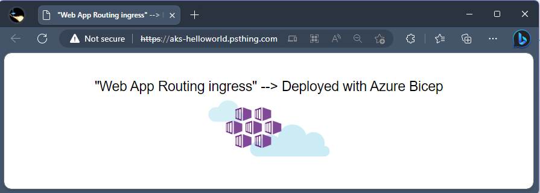

##### This is a repo for setting up AKS Namespaces for onboarding in Kubernetes

###### Goal
- Migrate an Helm Chart to Bicep format to test Bicep extensibility
- Use the Bicepparams experimentatal feature for params, that would replace the values.yaml from Helm
- Use the following new features
    - provider
    - import
    - export
- Export and Import user defined types and functions. 

###### Docs

- [Bicep Extensibility - Experminental Feature](https://learn.microsoft.com/en-us/azure/azure-resource-manager/bicep/bicep-config#enable-experimental-features)

- [Define Application in Bicep](https://learn.microsoft.com/en-us/azure/aks/learn/quick-kubernetes-deploy-bicep-extensibility-kubernetes-provider?tabs=PowerShell%2Cazure-powershell#add-the-application-definition)

- [AKS Ingress - Web Application Routing](https://learn.microsoft.com/en-us/azure/aks/web-app-routing?tabs=with-osm)

- [Bicep Custom Types](aka.ms/bicepCustomTypes)

#### bicepconfig.json for preview features
```json
{
  "experimentalFeaturesEnabled": {
    "paramsFiles": true,
    "extensibility": true,
    "symbolicNameCodegen": true,
    "userDefinedTypes": true,
    "resourceTypedParamsAndOutputs": true
  }
}
```

###### Bicep Extensibility uses `import`

- Example to create namespace

```bicep
@secure()
param kubeConfig string
param nameSpace string

import 'kubernetes@1.0.0' with {
  namespace: 'default'
  kubeConfig: kubeConfig
}

resource coreNamespace 'core/Namespace@v1' = {
  metadata: {
    name: nameSpace
  }
}
```
###### Example using bicepparam (replaces json format)

```bicep
using '../../bicep/main.bicep'

param DeploymentDef = {
  DeploymentId: '2'
  Environment: 'D'
  appName: 'AKS'
  orgName: 'PE'
  prefix: 'AEU1'
}

param DeploymentHubDef ={
  appName: 'HUB'
  orgName: 'PE'
  prefix: 'ACU1'
}

param AKSAppDefs = [
  {
    customDomain: 'aginow.net'
    image: 'mcr.microsoft.com/azuredocs/aks-helloworld:v1'
    nameSpace: 'hello-web-app-routing'
    serviceName: 'aks-helloworld'
    titleMessage: '"Web App Routing ingress" --> Deployed with Azure Bicep'
    clusterName: '01'
    tlsCertName: 'agic01-psthing-com'
  }
]

param VaultName = 'VLT01'
```
- Example for deploying main.bicep

```powershell
param (
    [switch]$whatif
)

$Base = $PSScriptRoot
$splat = @{
    Name                  = 'Namespace_Bicep'
    ResourceGroupName     = 'AEU1-PE-AKS-RG-D2'
    TemplateFile          = "$Base\bicep\main.bicep"
    TemplateParameterFile = "$Base\tenants\AKS\values-d2.bicepparam"
}

# requires az.resources 6.6.1 included in AZ 9.7.0
New-AzResourceGroupDeployment @splat -Verbose @PSBoundParameters
```

### Execute deployment...

```powershell
pwsh> . .\Bicep_Extensibility_AKS\setup_deploy.ps1

VERBOSE: Using Bicep v0.16.2
WARNING: WARNING: Symbolic name support in ARM is experimental, and should be enabled for testing purposes only. Do not enable this setting for any production usage, or you may be unexpectedly broken at any time!
WARNING: Resource-typed parameters and outputs in ARM are experimental, and should be enabled for testing purposes only. Do not enable this setting for any production usage, or you may be unexpectedly broken at any time!
VERBOSE: Using Bicep v0.16.2
WARNING: WARNING: Symbolic name support in ARM is experimental, and should be enabled for testing purposes only. Do not enable this setting for any production usage, or you may be unexpectedly broken at any time!
WARNING: Resource-typed parameters and outputs in ARM are experimental, and should be enabled for testing purposes only. Do not enable this setting for any production usage, or you may be unexpectedly broken at any time!
VERBOSE: Performing the operation "Creating Deployment" on target "AEU1-PE-AKS-RG-D2".
VERBOSE: 4:29:22 PM - Template is valid.
VERBOSE: 4:29:24 PM - Create template deployment 'Namespace_Bicep'
VERBOSE: 4:29:24 PM - Checking deployment status in 5 seconds
VERBOSE: 4:29:30 PM - Resource Microsoft.Resources/deployments 'AEU1-PE-AKS-D2-aks-helloworld' provisioning status is running
VERBOSE: 4:29:30 PM - Resource  '' provisioning status is succeeded
VERBOSE: 4:29:30 PM - Resource  '' provisioning status is succeeded
VERBOSE: 4:29:30 PM - Resource  '' provisioning status is succeeded
VERBOSE: 4:29:30 PM - Resource  '' provisioning status is succeeded
VERBOSE: 4:29:30 PM - Resource Microsoft.KeyVault/vaults 'ACU1-PE-HUB-P0-kvVLT01' provisioning status is succeeded
VERBOSE: 4:29:30 PM - Resource Microsoft.KeyVault/vaults/secrets 'ACU1-PE-HUB-P0-kvVLT01/agic01-psthing-com' provisioning status is succeeded
VERBOSE: 4:29:30 PM - Resource Microsoft.ContainerService/managedClusters 'AEU1-PE-AKS-D2-aks01' provisioning status is succeeded
VERBOSE: 4:29:30 PM - Resource Microsoft.ContainerService/managedClusters 'AEU1-PE-AKS-D2-aks01' provisioning status is succeeded
VERBOSE: 4:29:30 PM - Checking deployment status in 14 seconds
VERBOSE: 4:29:45 PM - Resource Microsoft.Resources/deployments 'AEU1-PE-AKS-D2-aks-helloworld' provisioning status is succeeded

DeploymentName          : Namespace_Bicep
ResourceGroupName       : AEU1-PE-AKS-RG-D2
ProvisioningState       : Succeeded
Timestamp               : 5/3/2023 11:29:43 PM
Mode                    : Incremental
TemplateLink            : 
Parameters              : 
                          Name                Type                       Value
                          ==================  =========================  ==========
                          deploymentDef       Object                     {"DeploymentId":"2","Environment":"D","appName":"AKS","orgName":"PE","prefix":"AEU1"}
                          deploymentHubDef    Object                     {"appName":"HUB","orgName":"PE","prefix":"ACU1"}
                          aksAppDefs          Array                      [{"customDomain":"aginow.net","image":"mcr.microsoft.com/azuredocs/aks-helloworld:v1","nameSpace":"hello-web-app-routing","serviceName":"aks-helloworld","titleMessage":"\"Web App Routing ingress\" --> Deployed with Azure
                          Bicep","clusterName":"01","tlsCertName":"agic01-psthing-com"}]
                          vaultName           String                     "VLT01"

Outputs                 : 
                          Name             Type                       Value
                          ===============  =========================  ==========
                          hostname         Array                      ["aks-helloworld.aginow.net"]

```

